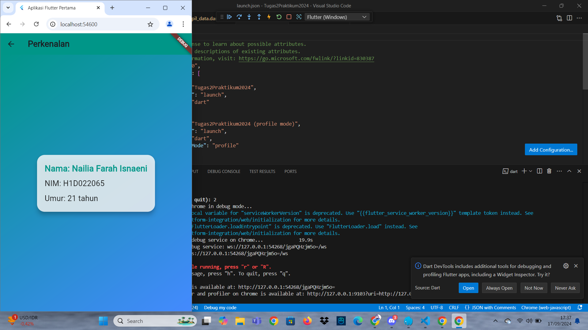

# Tugas Pertemuan 2

Fork dan clone repository ini, lalu jalankan perintah 
```
flutter pub get
```
Buatlah tampilan form yang berisi nama, nim, dan tahun lahir pada file `ui/form_data.dart`, lalu buatlah tampilan hasil dari input data tersebut pada file `ui/tampil_data.dart`

JELASKAN PROSES PASSING DATA DARI FORM MENUJU TAMPILAN DENGAN FILE `README.md`

Buat tampilan semenarik mungkin untuk dilihat.


Nama : ___

NIM : ___

Shift Baru: ___

## Screenshot
Contoh :



Pada aplikasi Flutter, proses passing data dari satu halaman ke halaman lain dimulai ketika pengguna mengisi form di halaman pertama, yaitu FormData. Form ini memiliki beberapa input yang dikelola oleh `TextEditingController` untuk menangkap data seperti nama, NIM, dan tahun lahir. Saat pengguna menekan tombol Simpan, data yang dimasukkan dalam form tersebut diambil dari controller, kemudian diolah lebih lanjut jika diperlukan, seperti memparsing tahun lahir dari string menjadi integer.

Setelah data diperoleh, aplikasi menggunakan Navigator.push() untuk berpindah ke halaman baru, yaitu TampilData. Proses ini menciptakan rute baru ke halaman tersebut sambil mempassing data yang diambil dari form sebagai argumen ke konstruktor `TampilData`. Konstruktor ini menerima tiga parameter (nama, NIM, dan tahun lahir), yang kemudian digunakan di dalam widget untuk ditampilkan kepada pengguna.

Di halaman TampilData, data yang diterima melalui konstruktor disimpan sebagai properti final, dan dalam method `build()`, data tersebut diolah lebih lanjut, misalnya menghitung umur dari tahun lahir, dan kemudian ditampilkan dalam bentuk teks. Hasil akhir yang ditampilkan berupa informasi lengkap tentang nama, NIM, dan umur pengguna yang dihitung secara dinamis. Proses ini memastikan bahwa data dapat dipassing dengan mudah antara halaman, memfasilitasi interaksi pengguna dan tampilan aplikasi yang dinamis.